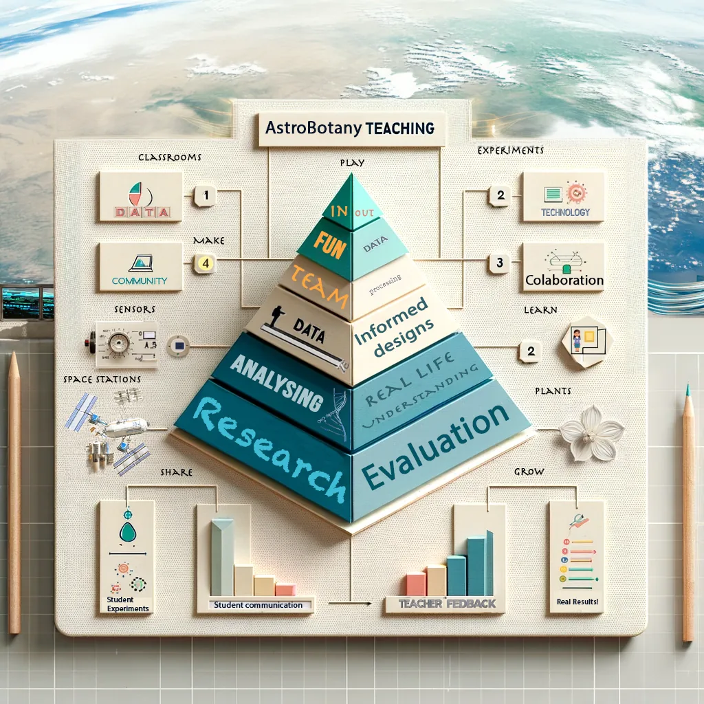

# 🌱🚀 Grow Plants in Space

## The Astrobotany International Research Initiative (AIRI)

How do plants grow when there is no "up"? Astronauts need plants for food, oxygen,
and a little piece of home &mdash; but space is a strange place to be a seed. **AIRI is a
free, hands-on program that lets your classroom join the real science of growing
plants beyond Earth.** Grow microgreens, measure how their roots respond to gravity,
collect real data on your phone, and share it with student scientists around the world.

<figure markdown="span">
  { width="640" }
  <figcaption>Astrobotany blends biology, data science, art, and space exploration.</figcaption>
</figure>

!!! tip "New here? Start with the path that fits you."

-   :material-school:{ .lg .middle } __For Teachers__

    ---

    Project-based lessons mapped to **Next Generation Science Standards**, with
    materials lists, low-cost setups, and data tools your students will love.

    [:octicons-arrow-right-24: Teacher's guide](for-teachers.md)

-   :material-test-tube:{ .lg .middle } __For Students__

    ---

    Become a citizen scientist. Grow your own microgreens, run real experiments,
    and add your data to a worldwide project.

    [:octicons-arrow-right-24: Start at Stage I](stage-i-space-invaders-data-literacy/README.md)

-   :material-rocket-launch:{ .lg .middle } __For Researchers__

    ---

    Computational modelling, RNA-seq mining, and clinostat experiments for
    advanced learners and citizen scientists who want to go deeper.

    [:octicons-arrow-right-24: Extension & research track](stage-vii-modelling-of-plant-hormone-transport.md)

## The AIRI journey

The program is built as a series of **stages**. You don't have to do them all &mdash;
start anywhere that fits your classroom and your budget. The first stages need little
more than seeds, water, and a smartphone.

=== "🧑‍🏫 Classroom Track (start here)"

    | Stage | What you'll do | You'll need |
    |-------|----------------|-------------|
    | **I — Space Invaders & Data Literacy** | Learn what "data" means by playing a game and exploring digital footprints. | A computer or tablet |
    | **II — Favorite Microgreen** | Pick a crop and vote with the world. Explore real nutrition and yield data. | Internet access |
    | **III — Growing Microgreens** | Grow microgreens in soil, photograph them daily, and measure growth. | Seeds, trays, a phone camera |
    | **IV — Gravity & Roots** | Grow roots on agar, then rotate gravity 90° and watch them respond. | Seeds, agar or filter paper |

=== "🔬 Extension & Research Track"

    | Stage | What you'll do |
    |-------|----------------|
    | **V — Auxin & Plant Cloning** | Explore plant hormones and make plant clones from cell cultures. |
    | **VI — Micro-Gravi-tropism Assays** | Quantify how roots and shoots reorient to gravity. |
    | **VII — Hormone Transport Modelling** | Simulate how auxin moves between plant cells. |
    | **VIII — Root Modelling** | Model water movement and hydropatterning in roots. |
    | **IX — Plant Modelling** | Explore whole-plant and photosynthesis models. |
    | **X — Mining RNA-seq** | Use real spaceflight gene-expression data to model metabolism. |
    | **XI — Membrane Interactome** | Investigate the proteins plants use to sense their environment. |

[See the full program overview :octicons-arrow-right-24:](program-overview.md){ .md-button }
[Browse all stages :octicons-arrow-right-24:](airi-astrobotany-introduction/README.md){ .md-button .md-button--primary }

## Why this is real science

AIRI follows an **open, FAIR** approach &mdash; the data you collect is *Findable, Accessible,
Interoperable, and Reusable*. We're brand-agnostic but recommend proven free tools like
[Epicollect5](https://five.epicollect.net/) for sharing data globally. Everything on this
site is released to the public domain ([CC0 1.0](https://creativecommons.org/publicdomain/zero/1.0/)),
so you are free to use, remix, and translate it for your own classroom.

> *Equity lies at the roots of education.* Whether you're a university professor or a
> curious kid with a windowsill, there's a place for you in AIRI.

---

*A program of the SKG Astrobotany Research and Education Program (Osaka, Japan) and the
Gilroy Lab, University of Wisconsin&ndash;Madison.*
