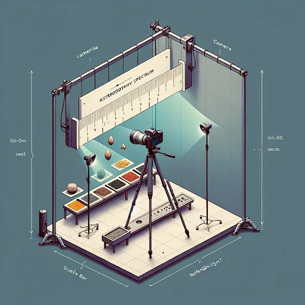
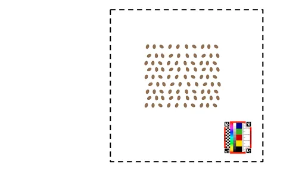

# Stage I: Scientific Photography of Space Plants 📷🌱

Before we can study how plants grow in space, we need to **see** them clearly — and
record what we see in a way that a computer (and other scientists) can measure. In
this first stage you'll learn the difference between a quick snapshot and a real
**science photograph**. It's a skill you'll use in every stage that follows.

!!! abstract "What you'll learn"
    - Why scientists photograph their experiments in a careful, repeatable way.
    - How to set up a camera, lights, background, and a scale bar.
    - How a computer "reads" your photo to measure a plant automatically.

<figure markdown="span">
  { width="520" }
  <figcaption>A simple, repeatable photo setup: camera straight on, two soft lights at 45°, a plain background, and a scale bar beside the plant.</figcaption>
</figure>

## A snapshot vs. a science photo

A phone snapshot is made to look nice. A **science photo** is made to be *measured* and
*compared* — by you today, by you next week, and by a researcher on the other side of
the planet. The trick is to keep everything the same every time except the plant itself.

Remember the **4 C's**:

| | What it means | Why it matters |
|---|---|---|
| **Contrast** | Plain background that stands out from the plant (black felt is usually best). | A computer can find the edge of the plant easily. |
| **Composition** | One plant near the centre, nothing overlapping it. | Measurements aren't confused by other objects. |
| **Consistency** | Same distance, same lighting, same angle every time. | Photos can be fairly compared to each other. |
| **Calibration** | A scale bar of known size in the photo. | Turns "pixels" into real centimetres. |

## Setting up your shot

- **Camera:** mounted **perpendicular** (straight-on) to the plant, on a tripod or
  stand so it doesn't move between photos.
- **Lighting:** two soft light sources at **45° angles** to reduce glare and shadows.
  Keep the light colour the same every time (don't mix daylight and a red grow-light).
- **Background:** a plain, **non-reflective** surface — black felt or card works well.
- **Scale bar:** place a ruler or the **AstroBotany Spectrum** sticker *in the same
  plane* as the plant, off to one side.

<figure markdown="span">
  { width="520" }
  <figcaption>Ask yourself: from this angle, could you (or a computer) easily draw a line around the plant's edge?</figcaption>
</figure>

## Quick-start checklist

- [ ] Camera on a tripod, pointing straight down/at the plant
- [ ] Plain, contrasting background behind the plant
- [ ] One plant near the centre, nothing overlapping
- [ ] A scale bar (ruler or Spectrum sticker) in the frame
- [ ] Same distance and lighting as your last photo
- [ ] Save the photo with the plant name, date, and time

## The AstroBotany Spectrum scale bar

The [**AstroBotany Spectrum**](https://astrobotany.com/product/airi-bio-imaging-spectrum-5cm/)
is a small printed strip of known size and colour. Including it in every photo lets
free software automatically work out how big your plant is and even check the colours
in your image. Keep it flat and in the same plane as the plant.

## Tools that "read" your photos

You don't measure by hand — these free tools do it for you:

- **[ImageJ / Fiji](https://imagej.net/software/fiji/)** — the classic scientific
  image-measuring tool.
- **[PlantCV](https://plantcv.readthedocs.io/en/stable/)** — plant-specific computer
  vision.
- **SOAPP** — a student-friendly app that works with the Spectrum sticker.
- **[Easy Leaf Area](https://github.com/heaslon/Easy-Leaf-Area)** — measures leaf area
  from a photo (used in Stage III).

## Classroom activity: measure your learning

Teachers can run a quick **two-stage survey** (a [Google Form](https://www.google.com/forms/)
works well) — once *before* and once *after* the photography session — to see how much
students' confidence and skill grew. The full set of questions and a step-by-step
educator guide are in the detailed guide below.

[:octicons-arrow-right-24: Read the full AstroBotany Photography Guide (SOP)](photography-guide.md){ .md-button .md-button--primary }

---

!!! tip "Next stop"
    Once you can take a clean, measurable photo, you're ready to put it to work in
    [Stage II: What's Your Favorite Microgreen?](../stage-ii-whats-your-favorite-microgreen/README.md)
    and [Stage III: Growing Microgreens](../stage-iii-growth-of-microgreens-in-terrestrial-environments/README.md).
