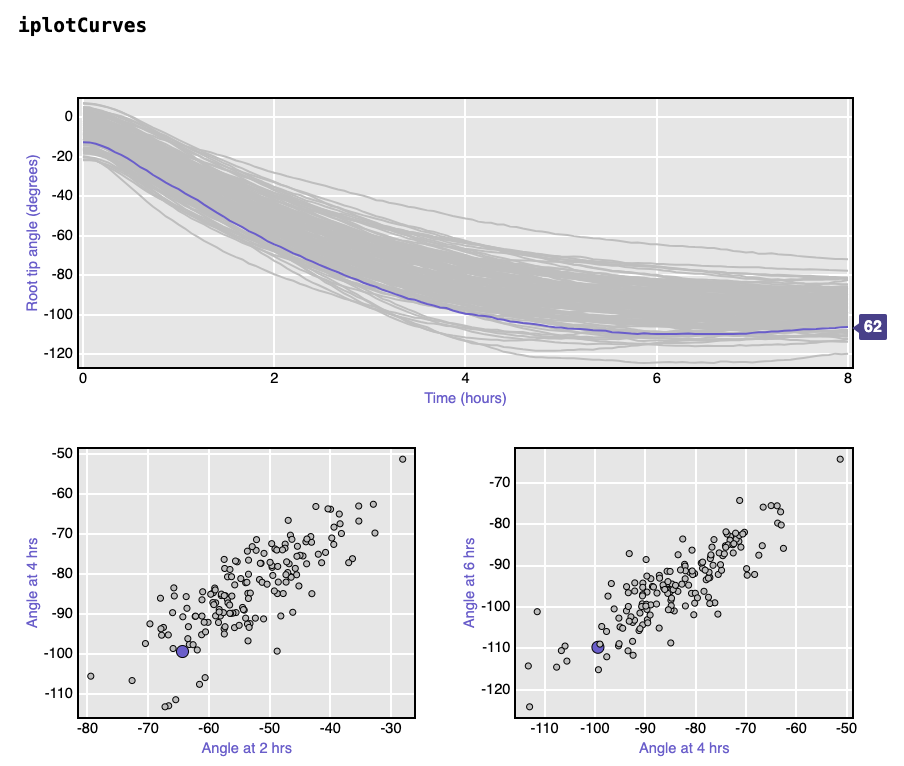

# Gravity and mechanical sensing in plants



**Above:** Time-lapse photography showing _Arabidopsis_ seedling responding to 90 degrees rotation.

Gravity represents the most ubiquitous and pervasive of biological signals and its perception and response (gravimorphogenesis) play critical roles in determining overall plant development and productivity. At present, the site of gravity perception in both the root and aerial parts of the plant has been defined to the tissue level and several players in the gravi-response, such as the auxin transporter systems, have been characterized. However, we still lack a cellular and molecular understanding of how gravity and touch perception occur and how this is translated to the precise regional regulation of growth that characterizes the gravity response in plants.

We are therefore using a combination of molecular genetics, cellular imaging and morphometric /kinematic image analyses to map cellular-level signalling events, such as Ca2+-dependent signals onto the growth response in wild-type and a range of hormone and growth-related mutants in _Arabidopsis_.

More information can be found at [www.astrobotany.com](http://www.google.com/url?q=http%3A%2F%2Fwww.astrobotany.com\&sa=D\&sntz=1\&usg=AOvVaw197zIdDARDOWJaEc8pOavB)

***

## Natural variation in how plants sense gravity 

_Arabidopsis_ plants live in a range of different natural environments around the world and have [adapted to their local environmental factors](https://www.google.com/url?q=https%3A%2F%2Frstudio.aws.science.psu.edu%3A3838%2Faaf11%2FAraCLIM%2F\&sa=D\&sntz=1\&usg=AOvVaw2z7L9ztVmKiS0c-zjEqJCj). This tool allows you to investigate natural variation in their environments. Below is data generated with a genetic mapping population that uses natural variation to investigate the genetic response of plants to a gravitropic stimulus.

<figure><figcaption>
<a href="https://kbroman.org/qtlcharts/example/iplotCurves.html">https://kbroman.org/qtlcharts/example/iplotCurves.html</a>
</figcaption></figure>

**Above:** Link to  Analysis of root reorientation kinetics after a 90 degree rotation reveals natural variation in the sensitivity of plants to gravity.

### Genetically encoded gravity sensing loci 

<figure><figcaption>
<a href="https://kbroman.org/qtlcharts/example/iplotMScanone.html">https://kbroman.org/qtlcharts/example/iplotMScanone.html</a>
</figcaption></figure>

**Above:** Link to Quantitative trait locus analysis of the _Arabidopsis_ genome identifies regions that contain genes involved in gravity perception and response. The red and blue heatmap shows regions that are positively or negatively correlated with the speed of reorientation. _Arabidopsis_ has 5 chromosomes. The higher the LOD score in that region of a chromosome, the higher the probably that genes found there are involved in the trait being measured.

Data visualization courtesy of [Karl Broman](https://www.google.com/url?q=https%3A%2F%2Fkbroman.org%2Fqtlcharts%2Fexample%2FiplotCurves.html\&sa=D\&sntz=1\&usg=AOvVaw31f8DzE48wCQ731Dq8G-ZH) and data courtesy of [Edgar Spalding](https://www.google.com/url?q=https%3A%2F%2Fspalding.botany.wisc.edu%2F\&sa=D\&sntz=1\&usg=AOvVaw2QKuj5JGlodORceQdiHAda).

&#x20;
